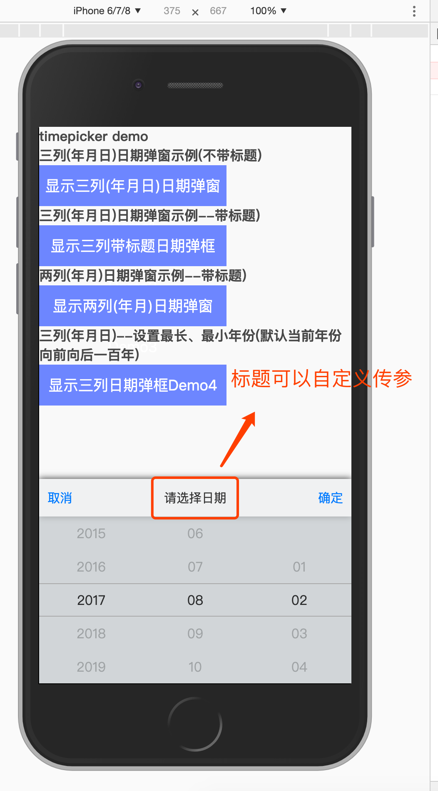
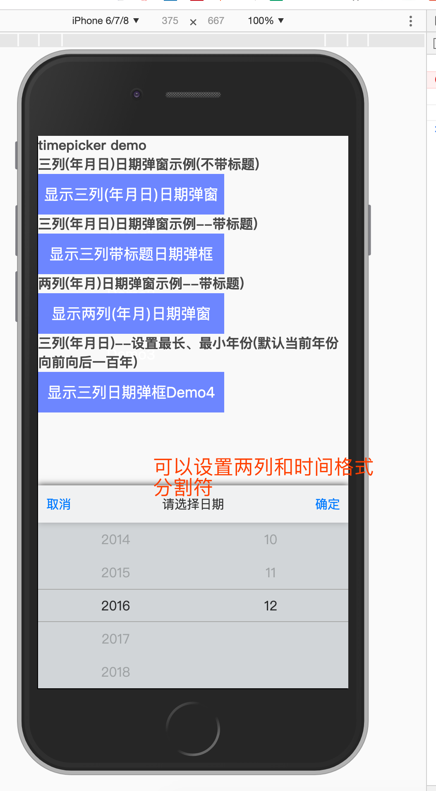

# 移动端日期选择组件

> A Vue.js project

## 1.优点：不需要依赖其他第三方库，灵活可配置：




## 2.用法：参见 src/view/demo.vue 文件的用法，简单易懂
```
    <div>
        <h3>三列(年月日)日期弹窗示例--带标题)</h3>
        <button class="blue-btn" @click="togglePicker2">显示三列带标题日期弹框Demo2</button>
        <v-date-picker :type="1" :isShow="isShow2" @confirm="confirmDemo2" @cancel="cancelDemo2" v-model="selectedValue2">请选择日期</v-date-picker>
    </div>
```


## 3.该例子基于vue进行示例： 运行命令如下： npm run dev 请先npm install

``` bash
# install dependencies
npm install

# serve with hot reload at localhost:8080
npm run dev

# build for production with minification
npm run build

# build for production and view the bundle analyzer report
npm run build --report

# run unit tests
npm run unit

# run all tests
npm test
```

For a detailed explanation on how things work, check out the [guide](http://vuejs-templates.github.io/webpack/) and [docs for vue-loader](http://vuejs.github.io/vue-loader).

## 4.结语：如对您有帮助，请给一个github start
如果有问题欢迎拍砖提问题，进行优化
